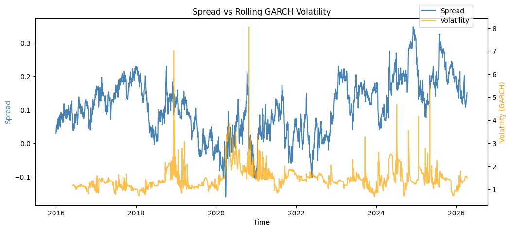
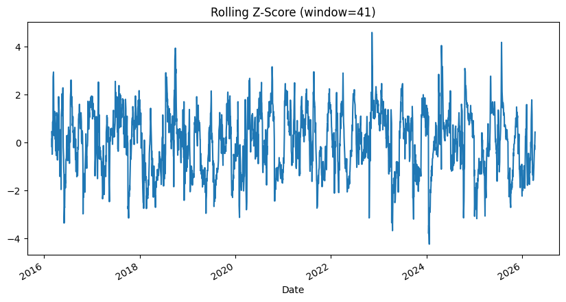
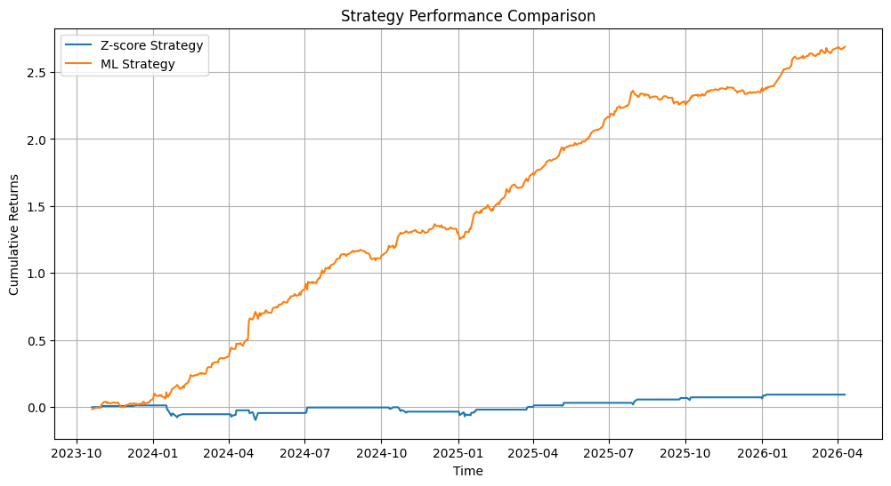
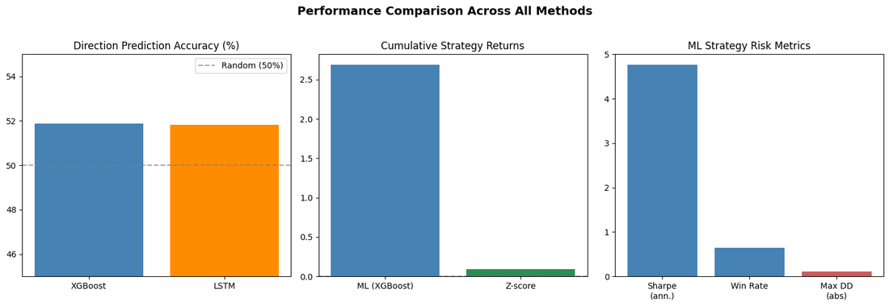

# Statistical Arbitrage on Indian Banking Equities

**A market neutral pair trading strategy on HDFC Bank and Kotak Mahindra Bank, combining cointegration testing, volatility modeling and machine learning spread prediction.**

Classical econometrics validates the pair and sets the trade parameters. Machine learning generates the signal. The combination beats either approach on its own.

**Topics:** `quantitative-finance` `pair-trading` `statistical-arbitrage` `cointegration` `time-series` `garch` `kalman-filter` `arima` `xgboost` `lstm`

---

## The pair

- **HDFC Bank** (`HDFCBANK.NS`)
- **Kotak Mahindra Bank** (`KOTAKBANK.NS`)

Daily adjusted closing prices from Yahoo Finance, January 2016 to present, log transformed to stabilise variance.

Pair trading bets on mean reversion: when the price spread between two historically linked stocks drifts from its long run equilibrium, you short the rich leg and buy the cheap one and wait for the gap to close.

## Method

| Phase | Technique | Purpose |
|---|---|---|
| Data | yfinance, log transform | Adjusted daily closes, variance stabilised |
| Validation | Engle-Granger, ADF, KPSS | Confirm long run equilibrium and stationarity |
| Spread | OLS hedge ratio | Build the mean reverting signal |
| Dynamics | Half life estimation | Set the z-score window from the data |
| Volatility | Rolling GARCH(1,1) | One step ahead forecast with no look ahead bias |
| Hedge ratio | Kalman filter | Track how the relationship shifts over time |
| Signals | Shifted z-score, +/-2 thresholds | Trade on past information only |
| Forecasting | Rolling one step ahead ARIMA | Predict spread level |
| Classification | XGBoost | Predict next day spread direction |
| Nonlinear | LSTM | Capture nonlinear temporal patterns |
| Evaluation | Walk forward, TimeSeriesSplit | Test on unseen data realistically |

## Key results

**Cointegration.** Engle-Granger p = 0.00077, comfortably below 0.05. ADF confirms mean reversion, KPSS indicates a slowly drifting mean.

**Spread.** Static OLS hedge ratio beta = 1.1047, so `spread = log(HDFC) - 1.1047 x log(Kotak)`. Half life of about 42 trading days, which sets the 41 day rolling z-score window.

**Volatility.** Rolling GARCH(1,1) on a 100 day window, 2,436 leak free forecasts. Average volatility 1.465, with obvious clustering around the 2020 shock.

**Dynamic hedge ratio.** The Kalman filter puts the true hedge ratio between 0.9 and 1.15 across the sample, adapting through structural shifts such as the HDFC merger period where the static estimate misleads.

| Model | Task | Metric | Value |
|---|---|---|---|
| ARIMA(0,1,1), rolling 1-step | Spread level | RMSE | 0.01595 |
| XGBoost | Direction | Accuracy | 51.89% (CV 52.1%) |
| LSTM | Direction | Accuracy | 51.82% |

Both ML models land near random on daily direction, which is what the efficient market hypothesis predicts at this horizon. What matters is that a slight edge, applied with the right position rules, still compounds.

**Backtest**, walk forward across 5 TimeSeriesSplit folds:

| Strategy | Gross return | Sharpe (ann.) | Win rate | Max drawdown |
|---|---|---|---|---|
| XGBoost signals | 2.687 | 4.76 | 64.7% | -10.68% |
| Z-score baseline | 0.093 | | | |

The XGBoost strategy was positive across all five folds.

**Takeaway.** Econometrics is what makes the pair tradable. Machine learning is what makes the entries better. Neither half gets there alone.

## Screenshots

<table>
<tr>
<td width="50%">

**Spread vs rolling GARCH volatility** The mean-reverting spread with its one-step-ahead volatility forecast overlaid

</td>
<td width="50%">

**Rolling z-score** The 41-day signal that triggers long, short and exit trades

</td>
</tr>
<tr>
<td width="50%">

**Walk-forward backtest** Cumulative returns, XGBoost signals against the z-score baseline

</td>
<td width="50%">

**Performance summary** Direction accuracy, cumulative returns and risk metrics side by side

</td>
</tr>
</table>

## Tech stack

| Category | Libraries |
|---|---|
| Data | `yfinance`, `pandas`, `numpy` |
| Statistical testing | `statsmodels` (ADF, KPSS, Engle-Granger) |
| Volatility | `arch` (GARCH) |
| Dynamic hedge ratio | `pykalman` |
| Forecasting | `pmdarima`, `statsmodels` |
| Machine learning | `xgboost`, `scikit-learn` |
| Deep learning | `tensorflow` / `keras` |
| Visualisation | `matplotlib`, `seaborn` |

## Limitations

Returns are in spread-diff units, not capital returns, so they are not directly comparable to market benchmarks. The static OLS hedge ratio drives the strategy throughout, with the Kalman filter shown as a comparison rather than wired in. XGBoost and LSTM use fixed hyperparameters with no systematic tuning. The GARCH window is fixed at 100 days. There is no transaction cost model, position sizing or stop loss yet.

## Next

Transaction costs and Kelly position sizing, a stop loss for extreme z-score divergence, the Kalman spread used end to end, a buy and hold benchmark for context, and regime detection to flag periods where the cointegrating relationship breaks down.

## References

**Indian market**
- [HDFCBANK and ICICIBANK pair trading](https://github.com/harshu722/pairs_trading_strategy_on_hdfcbank_and_icicibank-personal-project)
- [Pairs trading, Indian IT stocks](https://github.com/anirudhjayaraman/Pairs-Trading-Indian-IT-Stocks)
- [Cointegration StatArb NSE](https://github.com/rugvedshete/Cointegration-StatArb-PairsTrading-NSE)
- [Nifty50 statistical arbitrage](https://github.com/beastytitan18/nifty50-statistical-arbitrage)

**General**
- [Pairs trading and cointegration strategy](https://github.com/pandeyyyy/Pairs_Tradind_and_CoIntegration_Strategy)

## Team

Devika Jonjale (B045), Saachi Shinde (B048), Manjiri Apshinge (B061)
Analysis and Forecasting of Time Series, Group 6, M.Sc. Data Science Div B
